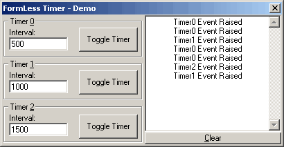

<div align="center">

## Anouther Formless Timer


</div>

### Description

This example shows a !completely! formless Timer alternative that only uses 2 API calls (SetTimer & KillTimer). This example also addresses some secuirity issues presented by the SetTimers CallBacks. I also defined all the exposed property descriptions for easy inclusion into your projects.
 
### More Info
 
Interval Property as a Long value representing Milliseconds.

Enabled Property used to Start or stop the Timer (Not to faroff from the VB Timer Control)

The API is finiky, I crashed the VB IDE 3 times developing this tidbit until I got it stable. If you want to modify the code save often or the API will bite you.

Returns a 'Timer' Event

Some security issues that you will see in the code/comments


<span>             |<span>
---                |---
**Submitted On**   |2002-03-27 01:48:44
**By**             |[Dane Jones](https://github.com/Planet-Source-Code/PSCIndex/blob/master/ByAuthor/dane-jones.md)
**Level**          |Intermediate
**User Rating**    |4.7 (61 globes from 13 users)
**Compatibility**  |VB 6\.0
**Category**       |[Libraries](https://github.com/Planet-Source-Code/PSCIndex/blob/master/ByCategory/libraries__1-49.md)
**World**          |[Visual Basic](https://github.com/Planet-Source-Code/PSCIndex/blob/master/ByWorld/visual-basic.md)
**Archive File**   |[Anouther\_F657673272002\.zip](https://github.com/Planet-Source-Code/dane-jones-anouther-formless-timer__1-33112/archive/master.zip)

### API Declarations

```
Private Declare Function SetTimer Lib "user32" _
   (ByVal hwnd As Long, _
   ByVal nIDEvent As Long, _
   ByVal uElapse As Long, _
   ByVal lpTimerFunc As Long) As Long
Private Declare Function KillTimer Lib "user32" _
   (ByVal hwnd As Long, _
   ByVal nIDEvent As Long) As Long
```


